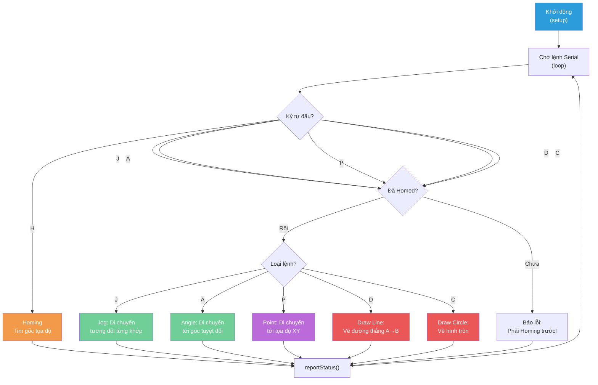

# 🤖 SCARA Robot Firmware — Tổng Quan Hoạt Động

## 1. Giới Thiệu Hệ Thống

Đây là firmware điều khiển robot SCARA 3 bậc tự do (2R + Z) chạy trên **Arduino** sử dụng **CNC Shield V3**. Robot có khả năng:

- **Điều khiển theo góc** (Forward Kinematics — Động học thuận)
- **Điều khiển theo tọa độ XY** (Inverse Kinematics — Động học ngược)
- **Vẽ đường thẳng và hình tròn** với nội suy tuyến tính/cung tròn
- **Giao tiếp Serial** với ứng dụng Python GUI để nhận lệnh và báo cáo trạng thái

---

## 2. Kiến Trúc Phần Cứng

```
┌─────────────────────────────────────────────────┐
│                   ARDUINO UNO                    │
│                  + CNC Shield V3                 │
├─────────────────────────────────────────────────┤
│  Chân 2,5  → Stepper 1 (Joint 1 — Khớp vai)    │
│  Chân 3,6  → Stepper 2 (Joint 2 — Khớp khuỷu)  │
│  Chân 12,13 → Stepper Z  (Trục Z — Lên/Xuống)   │
│  Chân 8    → EN (Enable tất cả motor)            │
│  Chân 9    → Limit Switch 1 (Home Joint 1)       │
│  Chân 10   → Limit Switch 2 (Home Joint 2)       │
└─────────────────────────────────────────────────┘
```

### Thông số cơ khí

| Thông số | Giá trị | Ý nghĩa |
|---|---|---|
| `L1` | 228.0 mm | Chiều dài link 1 (cánh tay trên) |
| `L2` | 136.5 mm | Chiều dài link 2 (cánh tay dưới) |
| `theta1AngleToSteps` | 44.444 steps/° | Tỷ lệ chuyển đổi góc → bước cho Joint 1 |
| `theta2AngleToSteps` | 35.556 steps/° | Tỷ lệ chuyển đổi góc → bước cho Joint 2 |
| `zMmToSteps` | 400 steps/mm | Tỷ lệ chuyển đổi mm → bước cho trục Z |

---

## 3. Flow Hoạt Động Chính



---

## 4. Các Giai Đoạn Hoạt Động

### 4.1 Giai đoạn 1: Khởi động (`setup`)

```
Serial 115200 baud → Cấu hình chân I/O → Enable Motor → Set tốc độ/gia tốc
```

- Khởi tạo Serial ở 115200 baud để giao tiếp với Python GUI
- Cấu hình limit switch với `INPUT_PULLUP`
- Bật motor bằng cách kéo `EN_PIN` xuống `LOW`
- Thiết lập tốc độ tối đa và gia tốc cho cả 3 stepper

### 4.2 Giai đoạn 2: Homing (Bắt buộc)

Robot **BẮT BUỘC** phải homing trước khi thực hiện bất kỳ lệnh nào khác. Flag `isHomed` kiểm soát điều này.

**Quy trình homing 3 bước:**

```
1. Quay ngược (tốc độ âm) → Chạm limit switch → Dừng
2. Lùi ra (backoff) một khoảng an toàn
3. Đặt vị trí hiện tại = gốc tọa độ (0,0)
```

- Cả 2 joint home **đồng thời** (concurrent), không tuần tự
- Sau homing: `θ1 = 0°, θ2 = 0°` → end-effector ở vị trí `(L1+L2, 0)` = `(364.5, 0)`

### 4.3 Giai đoạn 3: Xử lý lệnh

Robot lắng nghe Serial liên tục và phân loại lệnh qua **ký tự đầu tiên**:

| Lệnh | Format | Mô tả |
|---|---|---|
| `H` | `H` | Homing — Tìm gốc tọa độ |
| `J` | `J,<joint>,<delta>` | Jog — Dịch chuyển tương đối 1 khớp |
| `A` | `A,<θ1>,<θ2>,<Z>` | Angle — Di chuyển tới góc tuyệt đối |
| `P` | `P,<X>,<Y>` | Point — Di chuyển tới tọa độ XY (IK) |
| `D` | `D,<x1>,<y1>,<x2>,<y2>,<zUp>,<zDown>` | Draw Line — Vẽ đường thẳng |
| `C` | `C,<cx>,<cy>,<r>,<zUp>,<zDown>` | Draw Circle — Vẽ hình tròn |

### 4.4 Giai đoạn 4: Báo cáo trạng thái

Sau **mỗi lệnh**, robot gửi trả trạng thái qua Serial:

```
STATUS,<X>,<Y>,<Z>,<θ1>,<θ2>
```

Python GUI parse chuỗi này để cập nhật giao diện hiển thị.

---

## 5. Mô Hình Động Học

### 5.1 Động Học Thuận (Forward Kinematics)

Dùng khi biết góc → tính tọa độ đầu end-effector:

```
X = L1·cos(θ1) + L2·cos(θ1 + θ2)
Y = L1·sin(θ1) + L2·sin(θ1 + θ2)
```

→ Sử dụng trong lệnh `A` (Angle) và `J` (Jog)

### 5.2 Động Học Ngược (Inverse Kinematics)

Dùng khi biết tọa độ XY → tính góc các khớp:

```
cos(θ2) = (x² + y² - L1² - L2²) / (2·L1·L2)
θ2 = acos(cos(θ2))
θ1 = atan2(y, x) - atan2(L2·sin(θ2), L1 + L2·cos(θ2))
```

> **Lưu ý:** Code luôn chọn cấu hình **elbow-up** (θ2 ≥ 0) do sử dụng `acos()` trả về giá trị dương.

→ Sử dụng trong lệnh `P` (Point), `D` (Draw Line), `C` (Draw Circle)

### 5.3 Kiểm Tra Workspace

Trước khi tính IK, code kiểm tra điểm đích có nằm trong workspace không:

```
(L1 - L2)² ≤ x² + y² ≤ (L1 + L2)²
```

Nếu ngoài workspace → **bỏ qua lệnh** (silent return).

---

## 6. Cơ Chế Vẽ (Drawing)

### Nguyên tắc chung

Khi vẽ, robot **giảm tốc độ** và **tăng gia tốc rất cao** để di chuyển mượt mà theo từng bước nhỏ:

| Chế độ | MaxSpeed | Acceleration |
|---|---|---|
| Di chuyển thường | 2000 steps/s | 1000 steps/s² |
| Đang vẽ | 800 steps/s | 50000 steps/s² |

> **Mẹo:** Gia tốc cao (50000) khiến motor đạt tốc độ mục tiêu gần như tức thì, giúp di chuyển đều giữa các đoạn nội suy ngắn.

### Flow vẽ đường thẳng (`D`)

```
1. Nhấc bút lên (zUp)
2. Bay tới điểm bắt đầu (x1, y1)
3. Hạ bút xuống (zDown)
4. Nội suy đường thẳng (stepSize = 0.3mm)
5. Nhấc bút lên (zUp)
```

### Flow vẽ hình tròn (`C`)

```
1. Nhấc bút lên (zUp)
2. Bay tới mép đường tròn (cx+r, cy)
3. Hạ bút xuống (zDown)
4. Nội suy cung tròn (bước ≈ 0.5mm)
5. Nhấc bút lên (zUp)
```

---

## 7. Giao Tiếp Serial — Giao Thức

```
Python GUI                          Arduino
    │                                  │
    │──── H\n ────────────────────────>│
    │                                  │ (Homing...)
    │<─── STATUS,364.5,0,0,0,0 ───────│
    │                                  │
    │──── P,200,150\n ───────────────>│
    │                                  │ (IK + Move)
    │<─── STATUS,200,150,0,25.3,47.8 ─│
    │                                  │
    │──── D,100,100,250,200,10,0\n ──>│
    │                                  │ (Nhấc→Bay→Hạ→Vẽ→Nhấc)
    │<─── STATUS,250,200,10,32.1,55.4 │
```

---

## 8. Tóm Tắt Kiến Trúc Code

### Phân tầng chức năng

```
┌──────────────────────────────────────────────┐
│          Tầng Giao Tiếp (Communication)       │
│   loop() — Parser lệnh    reportStatus()     │
├──────────────────────────────────────────────┤
│           Tầng Điều Khiển (Control)           │
│  homing()   moveToAngleWithZ()   moveToXYZ() │
├──────────────────────────────────────────────┤
│          Tầng Vẽ (Drawing/Interpolation)      │
│  drawLine()  drawCircle()  calculateAndRunIK │
└──────────────────────────────────────────────┘
```

| Tầng | Hàm | Vai trò |
|---|---|---|
| Giao tiếp | `loop()` | Parse lệnh từ Serial, phân luồng xử lý |
| Giao tiếp | `reportStatus()` | Gửi trạng thái `STATUS,...` về GUI |
| Điều khiển | `homing()` | Tìm gốc tọa độ bằng limit switch |
| Điều khiển | `moveToAngleWithZ()` | Di chuyển tới góc + Z, tính FK cập nhật XY |
| Điều khiển | `moveToXYZ()` | Tính IK từ XY, gọi `moveToAngleWithZ()` |
| Vẽ | `drawLine()` | Chia đường thẳng thành nhiều đoạn nhỏ |
| Vẽ | `drawCircle()` | Chia đường tròn thành nhiều đoạn nhỏ |
| Vẽ | `calculateAndRunIK_Drawing()` | Tính IK và chạy motor cho từng điểm vẽ |
